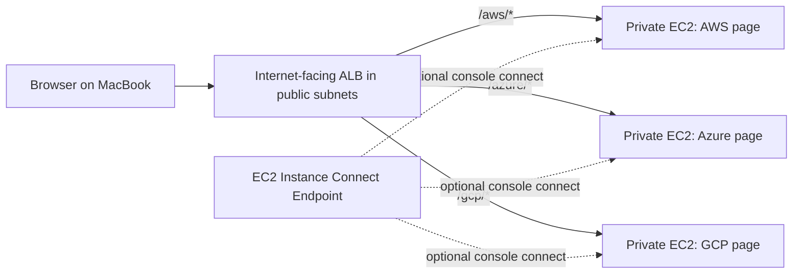

# Path-Based Routing Project

This project is for practicing AWS Application Load Balancer path-based routing.

We are following the document’s architecture:

- Public subnets for the internet-facing Application Load Balancer
- Private subnets for backend web servers
- Target groups for each backend path
- Listener rules that route traffic by URL path

## Changes for This Lab

- No Terraform.
- No NAT Gateway because KodeKloud Studio may not allow it.
- Use AWS Console **Connect** from your MacBook.
- Use EC2 Instance Connect Endpoint if KodeKloud allows it, because the backend servers are private.
- Since private servers have no internet access without NAT, they do not clone GitHub or install Apache. They use built-in Python from user data to serve simple HTML pages.

## Main Notes

Use this walkthrough when building the lab from scratch:

[Manual AWS Console Steps](docs/manual-aws-steps.md)

Completed project notes with screenshots:

[Project Notes](docs/project-notes.md)

Troubleshooting notes:

[Troubleshooting](docs/troubleshooting.md)

## Final Architecture



## Listener Rules

| Priority | Condition | Action |
| --- | --- | --- |
| `10` | `/aws` and `/aws/*` | Forward to `aws-tg` |
| `20` | `/azure` and `/azure/*` | Forward to `azure-tg` |
| `30` | `/gcp` and `/gcp/*` | Forward to `gcp-tg` |

## Test URLs

After the ALB becomes active, copy its DNS name and test:

```text
http://<alb-dns-name>/aws/
http://<alb-dns-name>/azure/
http://<alb-dns-name>/gcp/
```

Expected:

- `/aws/` opens the AWS backend page.
- `/azure/` opens the Azure backend page.
- `/gcp/` opens the GCP backend page.
