# AWS Path-Based Routing Project

This project demonstrates path-based routing using an AWS Application Load Balancer.

The Application Load Balancer is public, while the backend EC2 web servers are private. Requests are routed to different target groups based on the URL path.

## Project Goal

Build an AWS path-based routing setup where:

| URL path | Target group | Backend server |
| --- | --- | --- |
| `/aws/` | `aws-tg` | `aws-private-server` |
| `/azure/` | `azure-tg` | `azure-private-server` |
| `/gcp/` | `gcp-tg` | `gcp-private-server` |

## Architecture

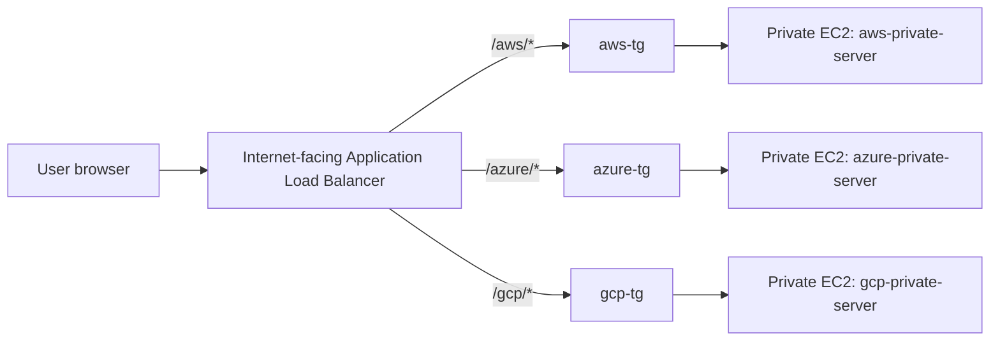

## Services Used

- Amazon VPC
- Public and private subnets
- Internet Gateway
- Route tables
- Security Groups
- EC2
- Target Groups
- Application Load Balancer
- ALB listener rules

## Important Design Choice

The original guide used a NAT Gateway for private instances. In this lab, NAT Gateway was skipped because it was not available in KodeKloud Studio.

To work around that, the private EC2 instances used Amazon Linux built-in Python web server from user data instead of installing Apache or cloning files from GitHub.

## Step 1: VPC Created

Created a custom VPC named `path-routing-vpc`.

| Setting | Value |
| --- | --- |
| VPC name | `path-routing-vpc` |
| IPv4 CIDR | `10.0.0.0/16` |
| Region | `us-east-1` |

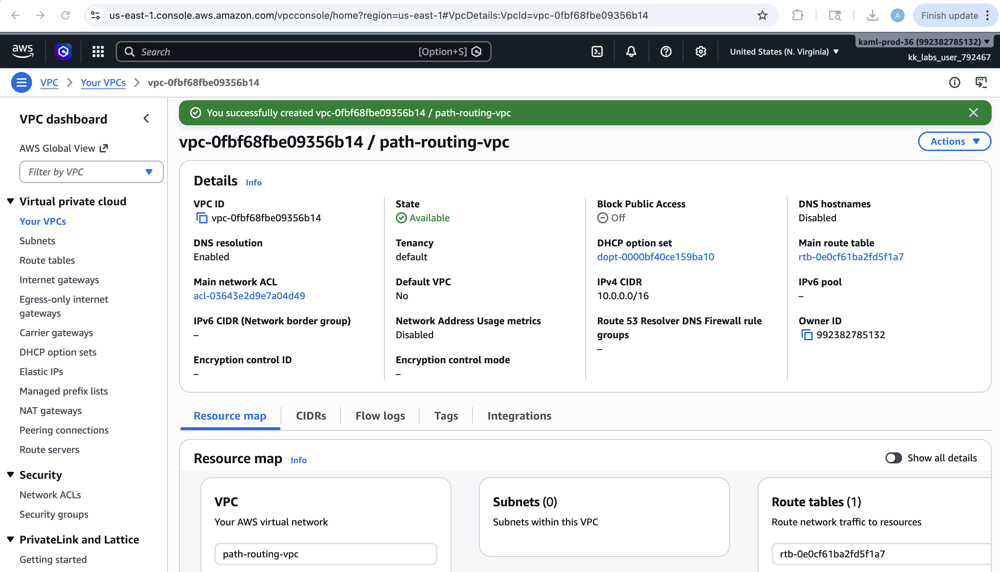

## Step 2: Subnets Created

Created two public subnets and two private subnets.

| Subnet | CIDR | Purpose |
| --- | --- | --- |
| `public-subnet-1` | `10.0.1.0/24` | ALB |
| `public-subnet-2` | `10.0.2.0/24` | ALB |
| `private-subnet-1` | `10.0.11.0/24` | AWS backend |
| `private-subnet-2` | `10.0.12.0/24` | Azure and GCP backends |

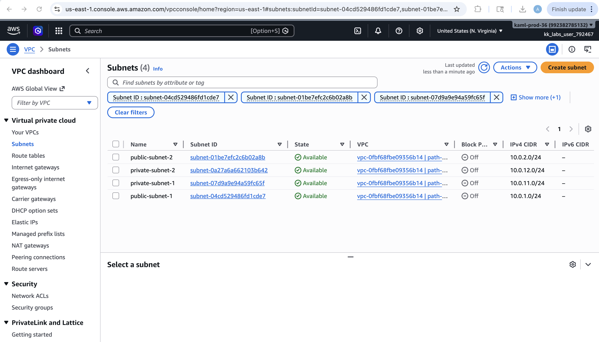

## Step 3: Internet Gateway Attached

Created and attached an Internet Gateway named `path-routing-igw` to the VPC.

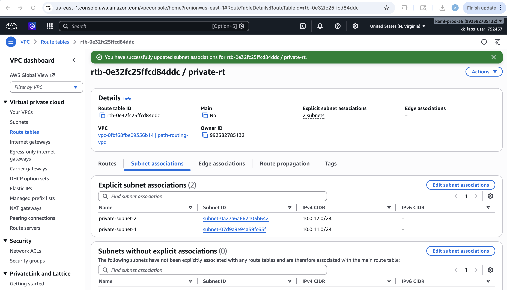

## Step 4: Route Tables Configured

Created a public route table named `public-rt`.

Public route table route:

| Destination | Target |
| --- | --- |
| `10.0.0.0/16` | local |
| `0.0.0.0/0` | Internet Gateway |

The public route table was associated with:

- `public-subnet-1`
- `public-subnet-2`

Created a private route table named `private-rt`.

Private route table route:

| Destination | Target |
| --- | --- |
| `10.0.0.0/16` | local |

The private route table was associated with:

- `private-subnet-1`
- `private-subnet-2`

## Step 5: Security Groups Created

Created `path-alb-sg` for the public Application Load Balancer.

Inbound rule:

| Type | Source |
| --- | --- |
| HTTP 80 | `0.0.0.0/0` |

Created `private-web-sg` for the private EC2 web servers.

Inbound rule:

| Type | Source |
| --- | --- |
| HTTP 80 | `path-alb-sg` |

This allows internet users to reach only the ALB. The private EC2 servers accept HTTP traffic only from the ALB.

## Step 6: Private EC2 Instances Launched

Launched three private EC2 instances.

| Instance | Subnet | Public IP |
| --- | --- | --- |
| `aws-private-server` | `private-subnet-1` | Disabled |
| `azure-private-server` | `private-subnet-2` | Disabled |
| `gcp-private-server` | `private-subnet-2` | Disabled |

Each instance used user data to create a path folder and start a Python web server on port 80.

Example for AWS:

```bash
#!/bin/bash
mkdir -p /var/www/html/aws
cat > /var/www/html/aws/index.html <<'HTML'
<h1>Amazon Web Services (AWS)</h1>
<p>This page is served from the private AWS backend instance.</p>
HTML
cd /var/www/html
nohup python3 -m http.server 80 > /tmp/aws-web.log 2>&1 &
```

## Step 7: Target Groups Created

Created three target groups.

| Target group | Registered target | Health check path |
| --- | --- | --- |
| `aws-tg` | `aws-private-server` | `/aws/` |
| `azure-tg` | `azure-private-server` | `/azure/` |
| `gcp-tg` | `gcp-private-server` | `/gcp/` |

All target groups became healthy after the ALB was associated.

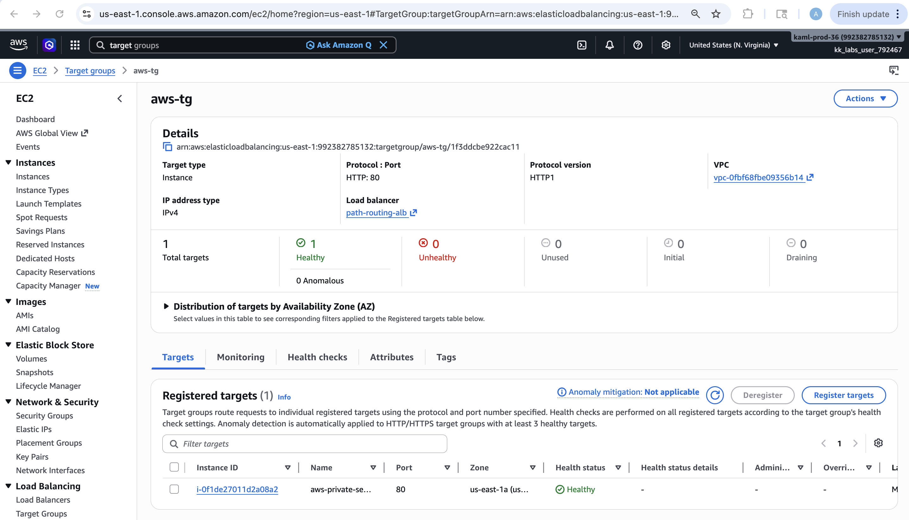

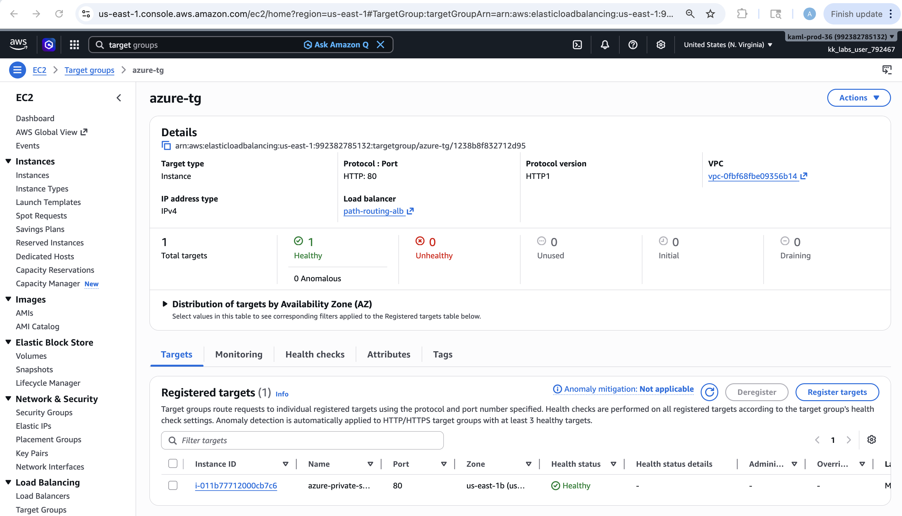

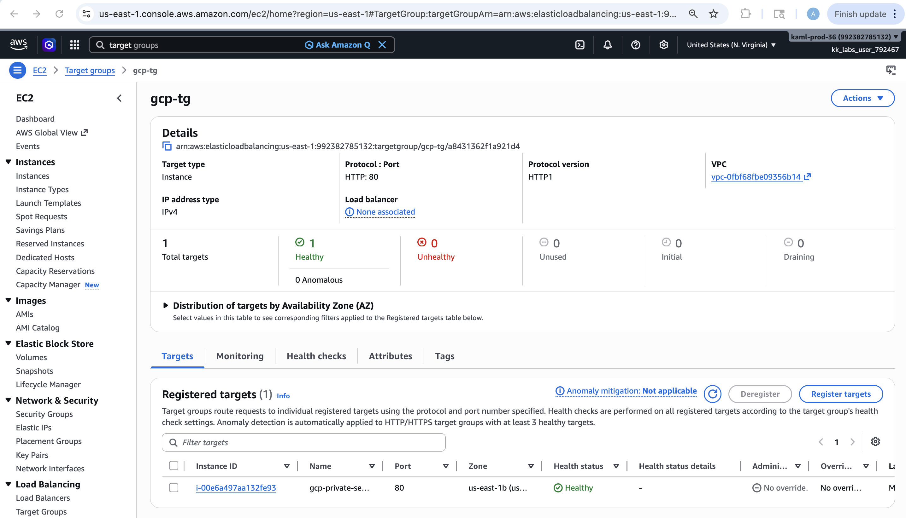

## Step 8: Application Load Balancer Created

Created an internet-facing Application Load Balancer named `path-routing-alb`.

| Setting | Value |
| --- | --- |
| Load balancer type | Application |
| Scheme | Internet-facing |
| VPC | `path-routing-vpc` |
| Subnets | `public-subnet-1`, `public-subnet-2` |
| Security group | `path-alb-sg` |
| Listener | HTTP 80 |
| Default target group | `aws-tg` |

## Step 9: Listener Rules Added

Added path-based listener rules.

| Priority | Path condition | Forward to |
| --- | --- | --- |
| `10` | `/aws/*` | `aws-tg` |
| `20` | `/azure/*` | `azure-tg` |
| `30` | `/gcp/*` | `gcp-tg` |
| Last | Default | `aws-tg` |

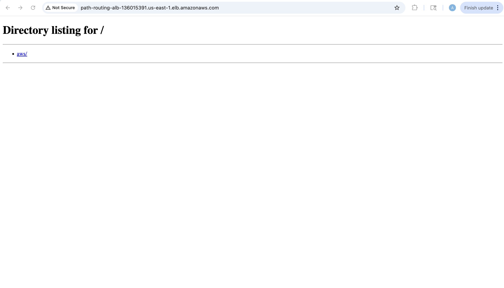

## Step 10: Testing

The ALB DNS name was:

```text
path-routing-alb-136015391.us-east-1.elb.amazonaws.com
```

### AWS Path Test

```text
http://path-routing-alb-136015391.us-east-1.elb.amazonaws.com/aws/
```

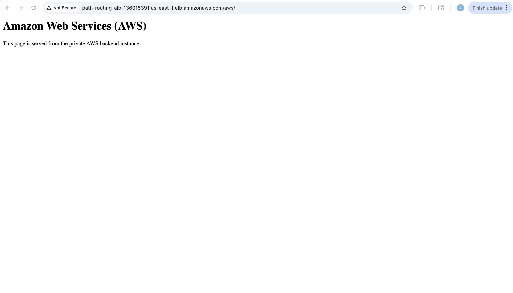

### Azure Path Test

```text
http://path-routing-alb-136015391.us-east-1.elb.amazonaws.com/azure/
```

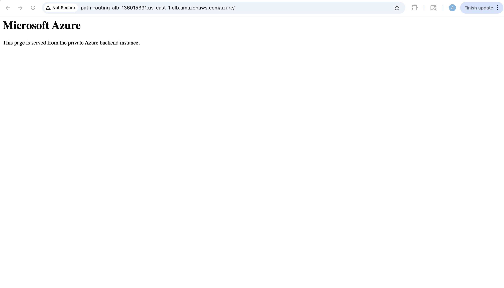

### GCP Path Test

```text
http://path-routing-alb-136015391.us-east-1.elb.amazonaws.com/gcp/
```

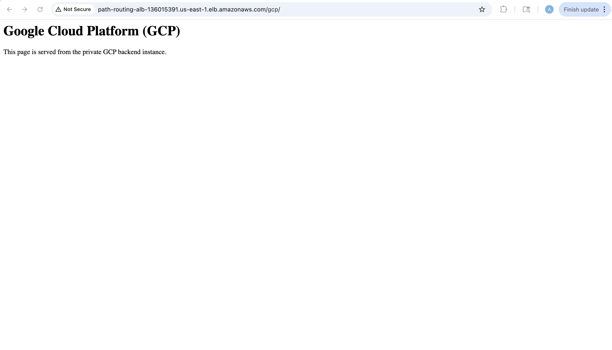

## Result

The project was completed successfully.

The Application Load Balancer routed requests based on URL path:

- `/aws/` returned the AWS backend page.
- `/azure/` returned the Azure backend page.
- `/gcp/` returned the GCP backend page.

## Cleanup

Delete resources in this order:

1. Application Load Balancer
2. Target Groups
3. EC2 instances
4. Security groups
5. Route tables
6. Internet Gateway
7. Subnets
8. VPC
